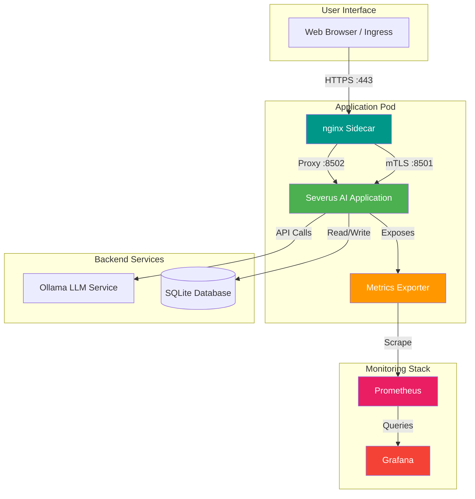
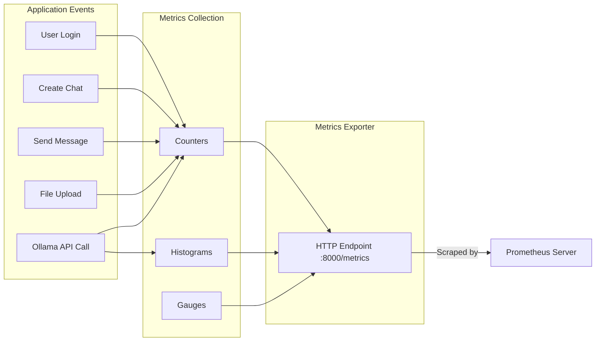

# Severus AI - Application Architecture

## Table of Contents
1. [Overview](#overview)
2. [System Architecture](#system-architecture)
3. [Component Breakdown](#component-breakdown)
4. [Core Features](#core-features)
5. [Code Implementation](#code-implementation)
6. [Technology Stack](#technology-stack)
7. [Data Flow](#data-flow)

## Overview

Severus AI is a cloud-native personal AI assistant built with Streamlit and integrated with Ollama for large language model inference. The application features comprehensive Prometheus metrics collection, user authentication, chat management, and file processing capabilities.

### Key Characteristics
- **Cloud-Native**: Fully containerized and Kubernetes-ready
- **Observable**: 15+ Prometheus metrics for monitoring
- **Scalable**: Horizontal Pod Autoscaler (HPA) enabled
- **Secure**: User authentication and RBAC
- **Resilient**: Health probes and self-healing capabilities

## System Architecture



## Component Breakdown

### 1. Main Application (app.py)

The core Streamlit application handling user interactions, chat management, and AI inference.

**Responsibilities:**
- User interface rendering
- Session management
- Chat creation and deletion
- Message handling
- File upload processing
- Integration with Ollama LLM

**Architecture Pattern:** Model-View-Controller (MVC)
- **Model**: `storage.py`, `chat.py`, `auth.py`
- **View**: Streamlit UI components
- **Controller**: `app.py` orchestration logic

### 2. Metrics System (metrics.py)

Comprehensive Prometheus metrics collection for observability.

**Metrics Categories:**
1. **Counters** (Monotonically increasing):
   - User activity: logins, signups
   - Chat activity: created, deleted, messages sent
   - File uploads by type
   - Ollama API calls by model and status
   - HTTP requests by method, endpoint, status
   - Application errors by type

2. **Histograms** (Distributions):
   - Ollama request duration (8 buckets: 0.5s to 120s)
   - HTTP request duration (8 buckets: 0.01s to 10s)

3. **Gauges** (Point-in-time values):
   - Active users (concurrent sessions)
   - Active chats (total in system)
   - Pod uptime (seconds since start)



### 3. nginx Sidecar (nginx.conf)

A high-performance security proxy running as a sidecar container in the same pod.

**Responsibilities:**
- **TLS Termination**: Handles external HTTPS traffic from the Ingress.
- **mTLS Enforcement**: Strictly validates client certificates for internal traffic.
- **Dual-Port Routing**:
  - **Port 8501**: Secure mTLS endpoint for pod-to-pod communication.
  - **Port 8080**: Plain HTTP endpoint for browser/Ingress access.
- **Internal Proxying**: Forwards all authorized traffic to Streamlit on **localhost:8502**.

### 4. Metrics Exporter (metrics_exporter.py)

Standalone HTTP server exposing Prometheus metrics on port 8000.

### 4. Authentication System (auth.py)

User registration and login system with SQLite backend.

**Security Features:**
- Password hashing (implementation-defined)
- Session management via Streamlit
- User validation
- Duplicate username prevention

### 5. Chat Management (chat.py)

CRUD operations for chat conversations and messages.

**Data Model:**
```
User (1) ----< (N) Chat (1) ----< (N) Message
                  |
                  |
                  v
              (N) File
```

### 6. File Processing

**Components:**
- `file_utils.py`: File upload and storage management
- `file_text_extractor.py`: Text extraction from PDFs, CSVs, images

**Supported Formats:**
- PDF (text extraction)
- CSV (data parsing)
- Images (OCR-ready)
- Text files

### 7. Ollama Integration (utils/ollama_client.py)

Client for communicating with Ollama LLM service.

**Features:**
- Streaming and non-streaming inference
- Model selection
- Error handling and retries
- Request duration tracking

## Core Features

### 1. User Authentication
- **Signup**: New user registration with username/password
- **Login**: Session-based authentication
- **Logout**: Session cleanup

### 2. Chat Management
- **Create Chat**: New conversation threads
- **List Chats**: View all user conversations
- **Switch Chat**: Navigate between conversations
- **Delete Chat**: Remove conversations and messages

### 3. AI Conversation
- **Message Input**: Natural language queries
- **Streaming Responses**: Real-time AI responses
- **Context Awareness**: Conversation history maintained
- **File Context**: Uploaded files can inform responses

### 4. File Upload
- **Multiple Formats**: PDF, CSV, TXT, images
- **Text Extraction**: Automatic content extraction
- **Storage**: Local filesystem persistence
- **Chat Association**: Files linked to specific chats

### 5. Metrics Dashboard
- Real-time Prometheus metrics exposure
- Grafana dashboard integration
- Performance monitoring
- User activity tracking

## Code Implementation

### Main Application Entry Point

