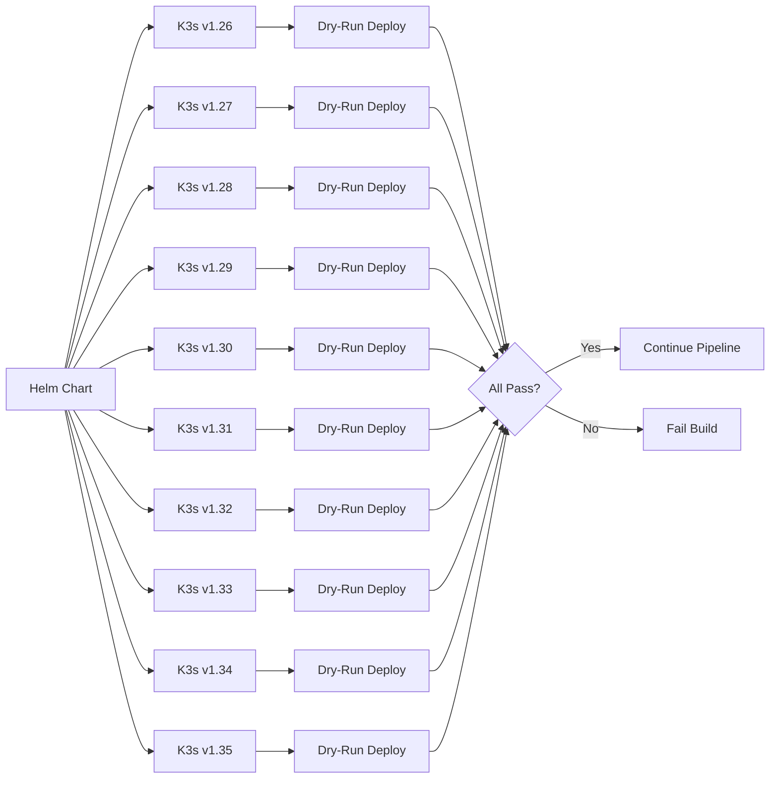
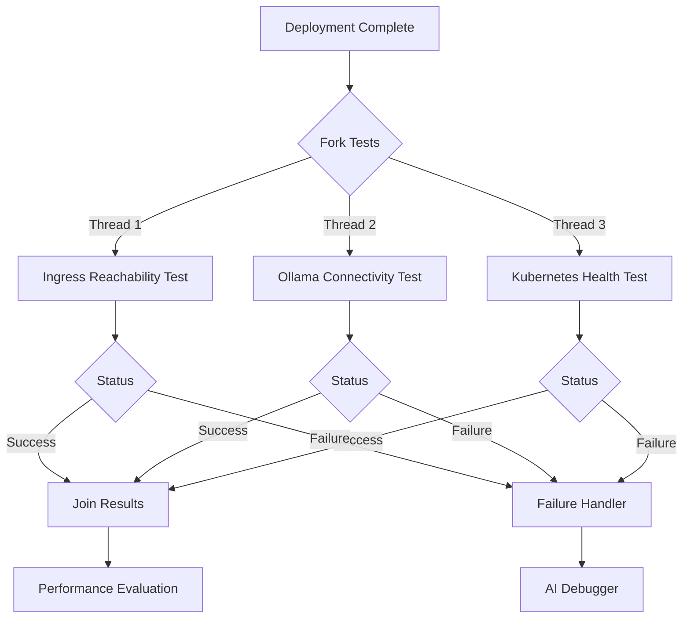

# Severus AI - CI/CD Pipeline Architecture

## Table of Contents
1. [Overview](#overview)
2. [Pipeline Architecture](#pipeline-architecture)
3. [Pipeline Stages](#pipeline-stages)
4. [Parallel Testing Strategy](#parallel-testing-strategy)
5. [K3s Multi-Version Validation](#k3s-multi-version-validation)
6. [Security Scanning](#security-scanning)
7. [Performance Evaluation](#performance-evaluation)
8. [AI Debugger Integration](#ai-debugger-integration)
9. [Complete Pipeline Code](#complete-pipeline-code)

## Overview

The Severus AI CI/CD pipeline is a comprehensive Jenkins-based automation system that handles:
- **Code checkout and validation**
- **Multi-stage Docker image builds**
- **Security vulnerability scanning**
- **K3s compatibility testing across 10 versions**
- **Parallel deployment and testing**
- **Stress testing and performance evaluation**
- **AI-powered automated debugging**

### Key Metrics
- **Total Stages**: 15+
- **Parallel Stages**: 3 (Post-Deployment Tests)
- **K3s Versions Validated**: 10 (v1.26 - v1.35)
- **Average Build Time**: 8-12 minutes
- **Security Scans**: Docker image vulnerabilities  
- **Performance Tests**: 20,000 concurrent requests

## Pipeline Architecture

```mermaid
graph TD
    Start([Start Pipeline]) --> Checkout[Checkout Code]
    Checkout --> MonitoringSetup[Setup Monitoring Stack]
    MonitoringSetup --> DockerBuild[Build Docker Image]
    DockerBuild --> SecurityScan[Security Scan - Trivy]
    SecurityScan --> StressBuild[Build Stress Pod Image]
    
    StressBuild -->|If Scan Pass| K3sValidation[K3s Multi-Version Validation]
    K3sValidation --> Push[Push to Docker Hub]
    Push --> Deploy[Deploy to K8s]
    
    Deploy --> ParallelTests{Parallel Tests}
    
    ParallelTests --> IngressTest[Ingress Reachability]
    ParallelTests --> OllamaTest[Ollama Connectivity]
    ParallelTests --> K8sHealth[Kubernetes Health]
    
    IngressTest --> Converge{All Tests Pass?}
    OllamaTest --> Converge
    K8s Health --> Converge
    
    Converge -->|Yes| PerfEval[Performance Evaluation]
    Converge -->|No| AIDebug[AI Debugger - Failure Mode]
    
    PerfEval -->|Success| AIDebugSuccess[AI Debugger - Success Mode]
    PerfEval -->|Failure| AIDebug
    
   AIDebugSuccess --> End([Build Complete])
    AIDebug --> End
    
    style DockerBuild fill:#4CAF50
    style SecurityScan fill:#FF9800
    style K3sValidation fill:#2196F3
    style ParallelTests fill:#9C27B0
    style PerfEval fill:#F44336
    style AIDebug fill:#FF5722
```

## Pipeline Stages

### 1. Checkout
**Purpose**: Retrieve source code from Git repository

```groovy
stage('Checkout') {
    steps {
        checkout scm
    }
}
```

### 2. Setup Monitoring Requirements
**Purpose**: Add Prometheus Helm repository for observability stack

```groovy
stage('Setup Monitoring Requirements') {
    steps {
        sh '''
            set -euo pipefail
            echo "📥 Adding Prometheus Helm repository..."
            $HELM_BIN repo add prometheus-community https://prometheus-community.github.io/helm-charts
            $HELM_BIN repo update
        '''
    }
}
```

### 3. Deploy Monitoring Stack
**Purpose**: Install Prometheus and Grafana for metrics collection

**Components Deployed:**
- Prometheus Server (metrics storage)
- Grafana (visualization)
- AlertManager (alerting)
- Node Exporter (node metrics)
- Kube State Metrics (cluster metrics)

```groovy
stage('Deploy Monitoring Stack') {
    steps {
        sh '''
            $HELM_BIN upgrade --install kube-prometheus-stack prometheus-community/kube-prometheus-stack \\
                --namespace default \\
                --set grafana.adminPassword=admin123 \\
                --set grafana.ingress.enabled=true \\
                --set grafana.ingress.ingressClassName=traefik \\
                --set grafana.ingress.hosts[0]=grafana.local \\
                --set prometheus.ingress.enabled=true \\
                --set prometheus.ingress.ingressClassName=traefik \\
                --set prometheus.ingress.hosts[0]=prometheus.local \\
                --set prometheus.ingress.paths[0]=/ \\
                --set prometheus.prometheusSpec.serviceMonitorSelectorNilUsesHelmValues=false
        '''
    }
}
```

### 4. Configure Application Monitoring
**Purpose**: Import Grafana dashboards and configure ServiceMonitor

**Process:**
1. Label ServiceMonitor for Prometheus discovery
2. Port-forward to Grafana service (port 3001)
3. Import custom dashboard via Grafana API
4. Verify dashboard creation

### 5. Docker Build Image
**Purpose**: Build production Docker image with no cache to ensure fresh builds

```groovy
stage('Docker Build Image') {
    steps {
        sh '''
            set -euo pipefail
            echo "🐳 Building Docker image..."
            $DOCKER_BIN --context ${DOCKER_CONTEXT} build \\
              --no-cache \\
              -t ${IMAGE_NAME}:${IMAGE_TAG} .
        '''
    }
}
```

**Why `--no-cache`?**
- Prevents stale code deployment from cached layers
- Ensures latest git commits are included
- Critical for development iterations

### 6. Security Scan
**Purpose**: Scan Docker image for known vulnerabilities using Trivy

```groovy
stage('Security Scan') {
    steps {
        sh '''
            set -euo pipefail
            echo "🔒 Running Trivy security scan..."
            
            if ! command -v trivy \u0026\u003e/dev/null; then
                echo "📥 Installing Trivy..."
                brew install trivy
            fi
            
            echo "🔍 Scanning image: ${IMAGE_NAME}:${IMAGE_TAG}"
            trivy image --severity HIGH,CRITICAL ${IMAGE_NAME}:${IMAGE_TAG} || true
        '''
    }
}
```

**Severity Levels Scanned:**
- **CRITICAL**: Immediate security risks
- **HIGH**: Significant vulnerabilities

### 7. Build Stress Pod Image
**Purpose**: Build specialized container for performance testing

```groovy
stage('Build Stress Pod Image') {
    steps {
        sh '''
            echo "🔨 Building stress-pod Docker image..."
            cd stress-pod
            $DOCKER_BIN --context ${DOCKER_CONTEXT} build \\
                -t sujanchow/stress-pod:${IMAGE_TAG} \\
                -t sujanchow/stress-pod:latest .
        '''
    }
}
```

## K3s Multi-Version Validation

**Purpose**: Ensure Helm chart compatibility across Kubernetes versions

### Validation Strategy



### Implementation Code

```groovy
stage('K3s Compatibility Matrix Validation') {
    steps {
        sh '''
            echo "🧪 Validating Helm chart across K3s versions..."
            mkdir -p k3s-validation-logs
            
            for VERSION in v1.26 v1.27 v1.28 v1.29 v1.30 v1.31 v1.32 v1.33 v1.34 v1.35; do
                $HELM_BIN upgrade --install severus-ai helm/severus-ai \\
                    --dry-run --debug \\
                    --set image.repository=${IMAGE_NAME} \\
                    --set image.tag=${IMAGE_TAG} \\
                    --set global.k3sVersion=$VERSION \\
                    \u003e k3s-validation-logs/$VERSION.log 2\u003e\u00261 || {
                    echo "❌ Validation failed for $VERSION"
                    exit 1
                }
            done
            
            echo "✅ All K3s versions validated successfully"
        '''
    }
}
```

### Benefits of Multi-Version Validation

1. **Future-Proofing**: Ensures compatibility with upcoming Kubernetes versions
2. **Migration Safety**: Validates smooth upgrades between cluster versions  
3. **API Deprecation Detection**: Catches deprecated API usage early
4. **Resource Compatibility**: Verifies resource definitions work across versions
5. **Production Readiness**: Confidence in multi-cluster deployments

## Parallel Testing Strategy

**Purpose**: Accelerate post-deployment validation through concurrent test execution

### Parallel Stages Architecture



### 1. Ingress Reachability Test

**Purpose**: Verify application is accessible through Traefik ingress

```groovy
stage('Ingress Reachability Test') {
    steps {
        sh '''
            echo "🌐 Testing Ingress reachability via Traefik (port 8081)..."
            
            kubectl -n kube-system port-forward svc/traefik 8081:80 \u003e/tmp/traefik.log 2\u003e\u00261 \u0026
            
            sleep 6
            
            curl --retry 5 --retry-delay 2 --fail -s \\
                -H "Host: severus-ai.local" \\
                http://127.0.0.1:8081 | grep -q "Streamlit"
            
            echo "✅ Ingress reachable via Traefik"
        '''
    }
    post {
        failure {
            sh '''
                echo "❌ Ingress Test Failed. Fetching pod logs..."
                $KUBECTL_BIN logs -l app=severus-ai --all-containers=true --tail=100 || true
            '''
        }
    }
}
```

**Validation Criteria:**
- Port-forward to Traefik succeeds
- HTTP request returns 200 OK
- Response contains "Streamlit" (validates app is serving correctly)

### 2. Ollama Connectivity Test

**Purpose**: Verify Ollama LLM service is reachable from application pod

```groovy
stage('Ollama Connectivity Test') {
    steps {
        sh '''
            echo "🧠 Testing Ollama connectivity (NON-BLOCKING)"
            
            POD=$($KUBECTL_BIN get pods -l app=severus-ai \\
                --field-selector=status.phase=Running \\
                -o jsonpath="{.items[0].metadata.name}")
            
            if [ -z "$POD" ]; then
                echo "⚠️ No running pod found (rolling deploy). Skipping."
                exit 0
            fi
            
            $KUBECTL_BIN exec "$POD" -- \\
                curl -s --max-time 5 http://host.docker.internal:11434/api/tags \\
                \u0026\u0026 echo "✅ Ollama reachable" \\
                || echo "⚠️ Ollama not reachable (allowed)"
            
            exit 0
        '''
    }
}
```

**Non-Blocking Design:**
- Test failure does not block pipeline
- Allows deployment in environments without Ollama
- Provides diagnostic information for troubleshooting

### 3. Kubernetes Health Test

**Purpose**: Verify pod deployment status and basic cluster health

```groovy
stage('Kubernetes Health Test') {
    steps {
        sh '''
            echo "🩺 Checking Kubernetes health..."
            $KUBECTL_BIN get pods -l app=severus-ai
        '''
    }
}
```

### Parallel Execution Benefits

**Time Savings:**
- **Sequential**: ~45 seconds (3 tests × 15s each)
- **Parallel**: ~15 seconds (longest test duration)
- **Improvement**: 66% faster validation

**Resource Efficiency:**
- Tests run independently
- No shared state/dependencies
- Failure in one test doesn't delay others

## Performance Evaluation

See [03_Performance_Evaluation.md](03_Performance_Evaluation.md) for comprehensive details.

**Quick Overview:**
- Deploys stress-pod Kubernetes Job
- Sends 20,000 HTTP GET requests
- Monitors success/failure rates
- Validates application can handle production load

## AI Debugger Integration

See [04_AI_Debugger.md](04_AI_Debugger.md) for comprehensive details.

**Trigger Conditions:**
```groovy
post {
    always {
        script {
            def buildResult = currentBuild.result ?: 'SUCCESS'
            echo "🤖 Running AI Debugger (Status: ${buildResult.toLowerCase()})..."
            
            sh '''
                python3 ai_debugger.py \\
                    --repo-path ${WORKSPACE} \\
                    --log-path ${WORKSPACE}/jenkins_console.log \\
                    --output-path report.txt \\
                    --model qwen2.5-coder:7b \\
                    --status ${buildResult.toLowerCase()}
            '''
        }
    }
}
```

**Modes:**
1. **SUCCESS**: Confirms healthy build, stores metrics
2. **FAILURE**: Extracts errors, locates in code, suggests fixes

## Complete Pipeline Code

### Environment Variables

```groovy
environment {
    IMAGE_NAME = "sujanchow/serverus-ai"
    IMAGE_TAG  = "v1"
    APP_PORT = "8505"
    
    DOCKER_BIN     = "/Applications/Docker.app/Contents/Resources/bin/docker"
    DOCKER_CONTEXT = "desktop-linux"
    PATH = "/Applications/Docker.app/Contents/Resources/bin:/usr/local/bin:/usr/bin:/bin:/usr/sbin:/sbin"
    
    PYTHON_BIN  = "/opt/homebrew/bin/python3"
    HELM_BIN    = "/opt/homebrew/bin/helm"
    KUBECTL_BIN = "/Applications/Docker.app/Contents/Resources/bin/kubectl"
}
```

### Full Pipeline Flow

