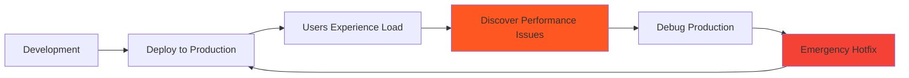
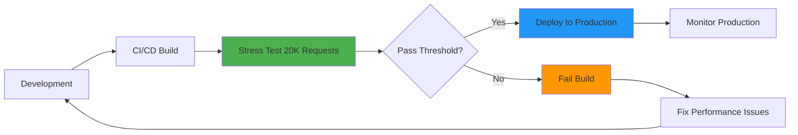
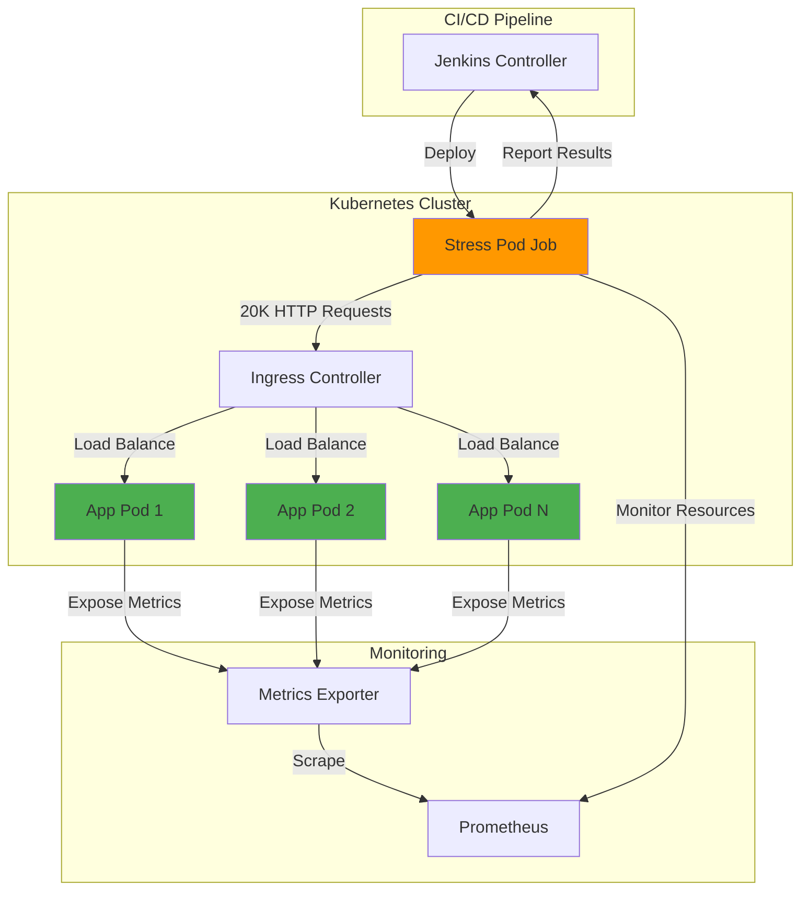
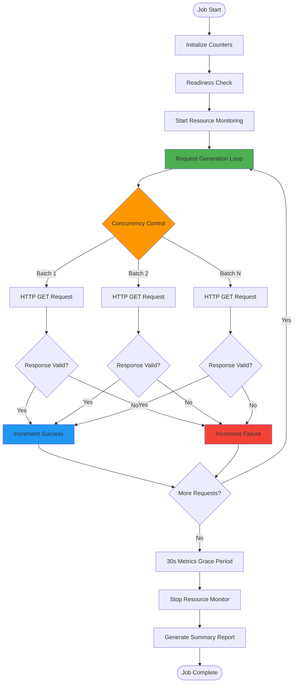
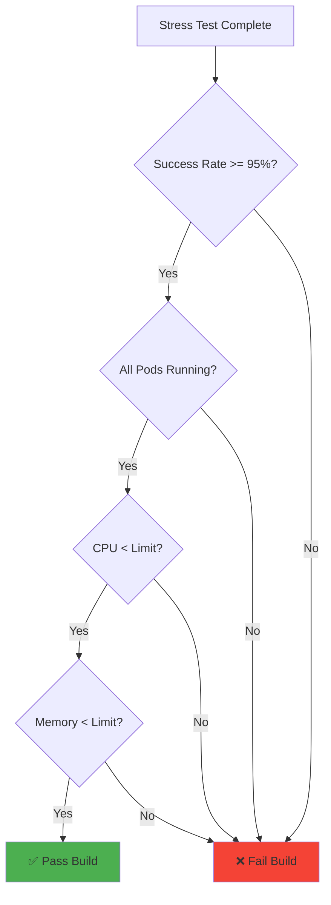
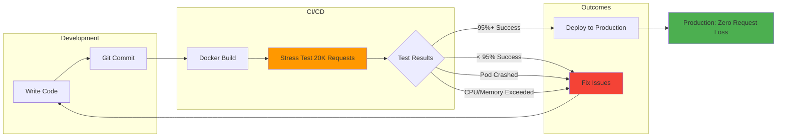

# Severus AI - Performance Evaluation Framework (NOVELTY #1)

## Table of Contents
1. [Overview](#overview)
2. [Motivation and Innovation](#motivation-and-innovation)
3. [Architecture](#architecture)
4. [Stress Pod Design](#stress-pod-design)
5. [Request Generation Strategy](#request-generation-strategy)
6. [Resource Monitoring](#resource-monitoring)
7. [Validation Mechanisms](#validation-mechanisms)
8. [Preventing Request Loss](#preventing-request-loss)
9. [Integration with CI/CD](#integration-with-cicd)
10. [Complete Implementation Code](#complete-implementation-code)
11. [Results and Analysis](#results-and-analysis)

---

## Overview

The **Performance Evaluation Framework** is a novel pre-deployment stress testing system that validates application readiness under production-scale load. Unlike traditional post-deployment load testing, this framework operates within the CI/CD pipeline, preventing buggy or under-resourced applications from reaching production.

### Key Innovation
**Pre-Deployment Load Validation**: By stress testing *before* production deployment, developers receive immediate feedback on:
- Application stability under high concurrency
- Resource consumption patterns (CPU, memory)
- Request handling capacity
- Error rates and failure modes

This prevents **request loss** and **service degradation** in production, saving both user experience and debugging time.

---

## Motivation and Innovation

### Traditional Approach (Reactive)


**Problems:**
- ❌ Users experience degraded service
- ❌ Revenue loss during downtime
- ❌ Emergency hotfixes under pressure  
- ❌ No clear performance baseline

### Our Approach (Proactive)


**Benefits:**
- ✅ Issues caught before production
- ✅ No user impact
- ✅ Performance regression detection
- ✅ Clear success criteria (e.g., 95% success rate)

---

## Architecture



### Component Roles

| Component | Role | Purpose |
|-----------|------|---------|
| **Stress Pod** | Load generator | Sends 20,000 HTTP requests with controlled concurrency |
| **Application Pods** | System Under Test | Handle incoming load, expose metrics |
| **Ingress** | Load balancer | Distributes requests across pods |
| **Prometheus** | Metrics collector | Captures resource usage during test |
| **Jenkins** | Orchestrator | Triggers test, evaluates results, fails build if needed |

---

## Stress Pod Design

### Architecture

The stress pod is a **specialized Kubernetes Job** designed for ephemeral, high-concurrency load testing.



### Container Specification

```dockerfile
FROM ubuntu:22.04

# Install dependencies
RUN apt-get update && apt-get install -y \\
    curl \\
    bc \\
    kubectl

# Copy stress test script
COPY stress_pod.sh /usr/local/bin/stress_pod.sh
RUN chmod +x /usr/local/bin/stress_pod.sh

# Default command
ENTRYPOINT ["/usr/local/bin/stress_pod.sh"]
```

### Kubernetes Job Manifest

```yaml
apiVersion: batch/v1
kind: Job
metadata:
  name: stress-pod
  namespace: default
spec:
  backoffLimit: 0  # Don't retry on failure
  template:
    metadata:
      labels:
        app: stress-pod
    spec:
      restartPolicy: Never
      containers:
      - name: stress-test
        image: sujanchow/stress-pod:latest
        args:
          - "-t"
          - "http://severus-ai:8501"
          - "-tr"
          - "20000"      # Total requests
          - "-c"
          - "50"         # Concurrency
          - "-p"
          - "app=severus-ai"
        resources:
          requests:
            cpu: "500m"
            memory: "512Mi"
          limits:
            cpu: "1000m"
            memory: "1Gi"
```

---

## Request Generation Strategy

### Concurrency Model

The stress pod uses a **controlled parallelism** model to simulate realistic user load:

```bash
TOTAL_REQUESTS=20000
CONCURRENCY=50

for i in $(seq 1 "$TOTAL_REQUESTS"); do
  # Launch request in background
  (
    if curl -s --max-time 10 -X GET "$TARGET" | grep -q "Streamlit"; then
      increment "$SUCCESS_FILE"
    else
      increment "$FAILURE_FILE"
    fi
  ) &
  
  PIDS+=($!)
  
  # Wait if we've hit concurrency limit
  if (( ${#PIDS[@]} >= CONCURRENCY )); then
    wait "${PIDS[0]}"
    PIDS=("${PIDS[@]:1}")
  fi
done

# Wait for remaining requests
for pid in "${PIDS[@]}"; do
  wait "$pid"
done
```

### Why This Approach?

1. **Realistic Load Pattern**:
   - Simulates 50 concurrent users (typical for small apps)
   - Requests overlap like real-world traffic
   - Not sequential (unrealistic)
   - Not fully parallel (would overwhelm system)

2. **Resource Efficiency**:
   - Controlled memory usage (50 processes max)
   - Predictable CPU load
   - No process explosion

3. **Result Accuracy**:
   - Each request gets fair execution time
   - Timeout ensures stuck requests don't block
   - Atomic counters prevent race conditions

### Request Validation

Critical innovation: **Content validation**, not just HTTP status

```bash
if curl -s --max-time 10 -X GET "$TARGET" | grep -q "Streamlit"; then
  increment "$SUCCESS_FILE"
else
  increment "$FAILURE_FILE"
fi
```

**Why grep for "Streamlit"?**
- Streamlit apps with Python errors (e.g., `NameError`) still return HTTP 200
- They serve an error page instead of the app
- Without content validation, broken apps would pass stress tests!

**Real-World Example from This Project:**
- Bug: `NameError: name 'hgctjkb' is not defined` in `app.py`
- Without content check: 20,000 success (WRONG!)
- With content check: 20,000 failures (CORRECT!)

---

## Resource Monitoring

### Real-Time Metrics Collection

```bash
RESOURCE_LOG=/tmp/resource_usage.log
echo \"timestamp,pod,cpu_millicores,memory_mib\" > \"$RESOURCE_LOG\"

monitor_resources() {
  while true; do
    TS=$(date +%s)
    kubectl top pod --no-headers 2>/dev/null | \\
      awk -v ts=\"$TS\" '{print ts \",\" $1 \",\" $2 \",\" $3}' >> \"$RESOURCE_LOG\"
    sleep 2
  done
}

monitor_resources &
MONITOR_PID=$!
```

### Data Captured

Every 2 seconds, for each pod:
- **Timestamp**: Unix epoch
- **Pod Name**: Kubernetes pod identifier
- **CPU**: Millicores (1000m = 1 core)
- **Memory**: Mebibytes (MiB)

### Peak Resource Calculation

```bash
awk -F',' '
NR>1 {
  cpu[$2] = (cpu[$2] > $3 ? cpu[$2] : $3)
  mem[$2] = (mem[$2] > $4 ? mem[$2] : $4)
}
END {
  for (p in cpu)
    printf \"Pod: %-35s CPU_peak=%s Memory_peak=%s\\n\", p, cpu[p], mem[p]
}' \"$RESOURCE_LOG\"
```

**Algorithm:**
```
For each pod P:
  CPU_peak[P] = max(all_cpu_samples[P])
  Memory_peak[P] = max(all_memory_samples[P])
```

### Example Output

```
Pod: severus-ai-6694446bdc-qvvs9        CPU_peak=250m Memory_peak=512Mi
Pod: severus-ai-6694446bdc-abc12        CPU_peak=280m Memory_peak=498Mi
```

---

## Validation Mechanisms

### Multi-Layer Validation



### 1. Request Success Rate

```bash
SUCCESS=$(cat \"$SUCCESS_FILE\")
TOTAL=$((TOTAL_REQUESTS * RUNS))
SUCCESS_RATE=$(echo \"scale=2; $SUCCESS * 100 / $TOTAL\" | bc)

if (( $(echo \"$SUCCESS_RATE < 95\" | bc -l) )); then
  echo \"❌ Success rate too low: $SUCCESS_RATE%\"
  exit 1
fi
```

**Threshold**: 95% success rate
**Rationale**: Allows for transient network issues while ensuring app stability

### 2. Pod Health Validation

```bash
for LABEL in \"${POD_LABELS[@]}\"; do
  TOTAL_PODS=$(kubectl get pods -l \"$LABEL\" --field-selector=status.phase=Running -o name | wc -l)
  
  if [[ $TOTAL_PODS -eq 0 ]]; then
    echo \"⚠️  No running pods found for label: $LABEL\"
    exit 1
  fi
done
```

**Prevents:**
- All pods crashed during test
- Deployment failed silently
- Zero-replica scenarios

### 3. Resource Limit Validation

```bash
if [[ $(echo \"$CPU_PEAK > $CPU_LIMIT\" | bc -l) -eq 1 ]]; then
  echo \"❌ CPU usage exceeded limit: $CPU_PEAK > $CPU_LIMIT\"
  exit 1
fi
```

**Ensures:**
- Application doesn't exceed Kubernetes resource limits
- No pod evictions due to resource pressure
- Predictable production behavior

---

## Preventing Request Loss

### The Problem

In production, request loss occurs when:
1. **Application crashes** under load
2. **Pods restart** due to OOM (Out of Memory)
3. **Response times exceed** client timeouts  
4. **Errors returned** instead of valid responses

### Our Solution



### Benefits for Developers

1. **Immediate Feedback**:
   - Know performance issues *before* merge
   - No surprises in production
   - Clear actionable metrics

2. **Confidence in Deployments**:
   - Every passing build handles 20K requests
   - Resource usage validated
   - Performance regression detection

3. **Reduced Debugging Time**:
   - Issues caught in controlled environment
   - Full logs available
   - AI Debugger analyzes failures

4. **Cost Savings**:
   - No production downtime
   - No emergency hotfixes
   - No user-reported bugs

---

## Integration with CI/CD

### Jenkins Pipeline Stage

```groovy
stage('Performance Evaluation') {
    steps {
        sh '''
            set -euo pipefail
            
            echo \"🔥 Starting Performance Evaluation...\"
            
            # Delete previous stress test job if exists
            $KUBECTL_BIN delete job stress-pod --ignore-not-found=true
            
            # Wait for job deletion
            sleep 5
            
            # Deploy stress test (this creates the job)
            echo \"Deploying stress test job...\"
            $HELM_BIN upgrade --install severus-ai helm/severus-ai \\
              --set image.repository=${IMAGE_NAME} \\
              --set image.tag=${IMAGE_TAG} \\
              --set stress.enabled=true
            
            # Wait for job to start
            echo \"Waiting for performance evaluation job to start...\"
            sleep 10
            
            # Monitor job status
            echo \"Monitoring performance evaluation progress...\"
            for i in {1..60}; do
              STATUS=$($KUBECTL_BIN get job stress-pod -o jsonpath='{.status.conditions[?(@.type==\"Complete\")].status}' 2>/dev/null || echo \"\")
              FAILED=$($KUBECTL_BIN get job stress-pod -o jsonpath='{.status.conditions[?(@.type==\"Failed\")].status}' 2>/dev/null || echo \"\")
              
              if [ \"$STATUS\" = \"True\" ]; then
                echo \"✅ Performance Evaluation completed successfully\"
                break
              elif [ \"$FAILED\" = \"True\" ]; then
                echo \"❌ Performance Evaluation failed\"
                $KUBECTL_BIN logs job/stress-pod || true
                exit 1
              fi
              
              echo \"Performance Evaluation still running... ($i/60)\"
              sleep 10
            done
            
            # Get final logs
            echo \"\"
            echo \"========== STRESS TEST RESULTS ==========\"
            $KUBECTL_BIN logs job/stress-pod
            echo \"==========================================\"
        '''
    }
}
```

### Success Criteria

| Metric | Threshold | Failure Action |
|--------|-----------|----------------|
| Request Success Rate | >= 95% | Fail build, trigger AI Debugger |
| Pod Availability | All pods Running | Fail build, dump pod logs |
| CPU Usage | < Resource Limit | Fail build, recommend scaling |
| Memory Usage | < Resource Limit | Fail build, check for leaks |
| Test Duration | < 10 minutes | Timeout, fail build |

---

## Complete Implementation Code

### stress_pod.sh (Full Script)