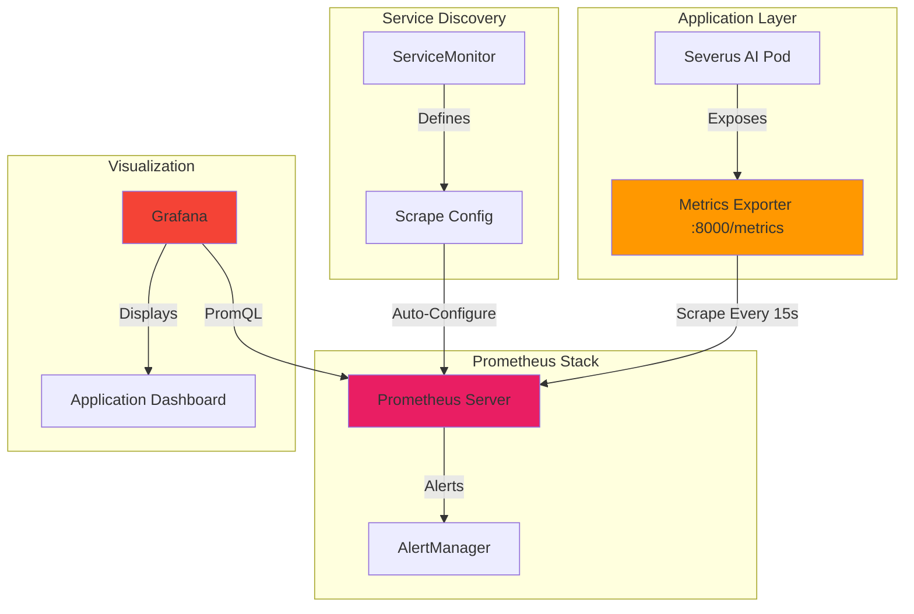

# Severus AI - Monitoring Stack (Prometheus & Grafana)

## Table of Contents
1. [Overview](#overview)
2. [Architecture](#architecture)
3. [Prometheus Configuration](#prometheus-configuration)
4. [Metrics Collection](#metrics-collection)
5. [Formulas and Calculations](#formulas-and-calculations)
6. [Grafana Dashboards](#grafana-dashboards)
7. [ServiceMonitor for Auto-Discovery](#servicemonitor-for-auto-discovery)

---

## Overview

The monitoring stack comprises **Prometheus** (metrics storage and querying) and **Grafana** (visualization). This setup provides complete observability into the Sever us AI application's:
- User activity (logins, chats, messages)
- Application performance (request duration, error rates)
- Resource usage (CPU, memory, uptime)
- System health (pod status, API availability)

---

## Architecture



---

## Prometheus Configuration

### Deployment via Helm

```yaml
helm upgrade --install kube-prometheus-stack prometheus-community/kube-prometheus-stack \
  --namespace default \
  --set grafana.adminPassword=admin123 \
  --set grafana.ingress.enabled=true \
  --set grafana.ingress.ingressClassName=traefik \
  --set grafana.ingress.hosts[0]=grafana.local \
  --set prometheus.ingress.enabled=true \
  --set prometheus.ingress.ingressClassName=traefik \
  --set prometheus.ingress.hosts[0]=prometheus.local \
  --set prometheus.ingress.paths[0]=/ \
  --set prometheus.prometheusSpec.serviceMonitorSelectorNilUsesHelmValues=false
```

### Key Configuration Parameters

| Parameter | Value | Purpose |
|-----------|-------|---------|
| `namespace` | `default` | Deploy in default namespace |
| `grafana.adminPassword` | `admin123` | Grafana login credentials |
| `grafana.ingress.enabled` | `true` | Enable HTTP access via Ingress |
| `grafana.ingress.hosts[0]` | `grafana.local` | Domain for Grafana UI |
| `prometheus.ingress.enabled` | `true` | Enable Prometheus UI access |
| `prometheus.ingress.hosts[0]` | `prometheus.local` | Domain for Prometheus UI |
| `prometheusSpec.serviceMonitorSelectorNilUsesHelmValues` | `false` | **CRITICAL**: Auto-discover all ServiceMonitors |

---

## Metrics Collection

### Application Metrics (Severus AI)

**Endpoint**: `http://severus-ai:8000/metrics`  
**Format**: Prometheus text-based exposition format  
**Scrape Interval**: 15 seconds

### Metric Categories

#### 1. Counters (Monotonically Increasing)

```
# User authentication
severus_login_total 127
severus_login_failures_total{reason="invalid_credentials"} 5
severus_signup_total 42

# Chat activity
severus_chat_created_total 215
severus_messages_sent_total{role="user"} 3420
severus_messages_sent_total{role="assistant"} 3418
severus_chat_deleted_total 18

# File uploads
severus_file_uploads_total{file_type="pdf"} 45
severus_file_uploads_total{file_type="csv"} 23

# Ollama API
severus_ollama_calls_total{model="gemma3:1b",status="success"} 3420
severus_ollama_calls_total{model="gemma3:1b",status="error"} 2

# HTTP requests
severus_http_requests_total{method="GET",endpoint="/",status="200"} 8540

# Errors
severus_errors_total{error_type="ollama_error"} 2
```

#### 2. Histograms (Distributions)

```
# Ollama request duration (seconds)
severus_ollama_request_duration_seconds_bucket{model="gemma3:1b",le="0.5"} 102
severus_ollama_request_duration_seconds_bucket{model="gemma3:1b",le="1.0"} 450
severus_ollama_request_duration_seconds_bucket{model="gemma3:1b",le="2.5"} 2100
severus_ollama_request_duration_seconds_bucket{model="gemma3:1b",le="5.0"} 3200
severus_ollama_request_duration_seconds_bucket{model="gemma3:1b",le="10.0"} 3400
severus_ollama_request_duration_seconds_bucket{model="gemma3:1b",le="+Inf"} 3420
severus_ollama_request_duration_seconds_sum{model="gemma3:1b"} 8240.5
severus_ollama_request_duration_seconds_count{model="gemma3:1b"} 3420

# HTTP request duration (seconds)
severus_http_request_duration_seconds_bucket{endpoint="/",le="0.01"} 5200
severus_http_request_duration_seconds_bucket{endpoint="/",le="0.05"} 8300
severus_http_request_duration_seconds_bucket{endpoint="/",le="0.1"} 8500
severus_http_request_duration_seconds_bucket{endpoint="/",le="+Inf"} 8540
severus_http_request_duration_seconds_sum{endpoint="/"} 425.2
severus_http_request_duration_seconds_count{endpoint="/"} 8540
```

#### 3. Gauges (Current Values)

```
# Active users (concurrent sessions)
severus_active_users 12

# Total active chats in system
severus_active_chats 215

# Pod uptime (seconds since start)
severus_pod_uptime_seconds 3642.5
```

---

## Formulas and Calculations

### 1. Request Rate (Requests per Second)

**PromQL Query:**
```promql
rate(severus_http_requests_total[5m])
```

**Formula:**
```
RPS = Δ(counter) / Δ(time)
```

**Example Calculation:**
```
At t0=0s:   severus_http_requests_total = 1000
At t1=300s: severus_http_requests_total = 1500

RPS = (1500 - 1000) / 300 = 1.67 requests/second
```

### 2. Error Rate (Percentage of Failed Requests)

**PromQL Query:**
```promql
sum(rate(severus_errors_total[5m])) / 
sum(rate(severus_http_requests_total[5m])) * 100
```

**Formula:**
```
Error Rate (%) = (Errors / Total Requests) × 100
```

**Example Calculation:**
```
Errors in 5min:       50
Total requests in 5min: 5000

Error Rate = (50 / 5000) × 100 = 1%
```

### 3. Average Response Time (P50 Latency)

**PromQL Query:**
```promql
histogram_quantile(0.5, 
  rate(severus_ollama_request_duration_seconds_bucket[5m])
)
```

**Formula (Histogram Quantile):**
```
For percentile p (0.5 for median):
1. Find buckets where cumulative count ≥ p × total_count
2. Interpolate within bucket to estimate exact value
```

**Example Calculation:**
```
Total requests: 1000
Target: P50 (50th percentile) → 500th request

Bucket cumulative counts:
le=0.5:  200
le=1.0:  600  ← 500th request is in this bucket
le=2.5:  900

Linear interpolation:
P50 = 0.5 + ((500 - 200) / (600 - 200)) × (1.0 - 0.5)
    = 0.5 + (300/400) × 0.5
    = 0.5 + 0.375
    = 0.875 seconds
```

### 4. P95 Latency (95th Percentile)

**PromQL Query:**
```promql
histogram_quantile(0.95, 
  rate(severus_ollama_request_duration_seconds_bucket[5m])
)
```

**Interpretation:**
- 95% of requests complete faster than this value
- Outlier detection
- SLA monitoring

### 5. Success Rate

**PromQL Query:**
```promql
sum(rate(severus_ollama_calls_total{status="success"}[5m])) /
sum(rate(severus_ollama_calls_total[5m])) * 100
```

**Formula:**
```
Success Rate (%) = (Successful Calls / Total Calls) × 100
```

### 6. Message Throughput

**PromQL Query:**
```promql
sum(rate(severus_messages_sent_total[5m]))
```

**Interpretation:**
- Messages per second across all users
- Chat activity indicator
- Load metric for capacity planning

### 7. Resource Utilization

**CPU Usage (Percentage of Limit):**
```promql
(rate(container_cpu_usage_seconds_total{pod=~"severus-ai.*"}[5m]) / 
 container_spec_cpu_quota{pod=~"severus-ai.*"}) * 100
```

**Memory Usage (Percentage of Limit):**
```promql
(container_memory_usage_bytes{pod=~"severus-ai.*"} / 
 container_spec_memory_limit_bytes{pod=~"severus-ai.*"}) * 100
```

---

## Grafana Dashboards

### Dashboard Import Process

```python
# import_dashboard.py
import requests

GRAFANA_URL = "http://localhost:3001"
USERNAME = "admin"
PASSWORD = "admin123"

dashboard_json = {
    "dashboard": {
        "title": "Severus AI - Application Metrics",
        "panels": [
            # Panel definitions
        ]
    },
    "overwrite": True
}

response = requests.post(
    f"{GRAFANA_URL}/api/dashboards/db",
    auth=(USERNAME, PASSWORD),
    json=dashboard_json
)
```

### Dashboard Panels

1. **Active Users** (Gauge)
   - Query: `severus_active_users`
   - Visualization: Single Stat

2. **Request Rate** (Graph)
   - Query: `rate(severus_http_requests_total[5m])`
   - Visualization: Time Series

3. **Error Rate** (Graph)
   - Query: `sum(rate(severus_errors_total[5m])) / sum(rate(severus_http_requests_total[5m])) * 100`
   - Visualization: Time Series with alert threshold

4. **Ollama Latency** (Heatmap)
   - Query: `histogram_quantile(0.95, rate(severus_ollama_request_duration_seconds_bucket[5m]))`
   - Visualization: Heatmap or Time Series

5. **Chat Activity** (Bar Chart)
   - Query: `sum by (role) (rate(severus_messages_sent_total[5m]))`
   - Visualization: Bar gauge

---

## ServiceMonitor for Auto-Discovery

### Configuration

```yaml
apiVersion: monitoring.coreos.com/v1
kind: ServiceMonitor
metadata:
  name: severus-ai
  namespace: default
  labels:
    release: kube-prometheus-stack  # CRITICAL for discovery
spec:
  selector:
    matchLabels:
      app: severus-ai
  endpoints:
  - port: metrics
    interval: 15s
    path: /metrics
```

### How It Works

````mermaid
graph LR
    ServiceMonitor[ServiceMonitor<br/>severus-ai] -->|Watches| Service[Service<br/>app=severus-ai]
    Service -->|Resolves to| Endpoints[Pod Endpoints]
    Prometheus[Prometheus Operator] -->|Reads| ServiceMonitor
    Prometheus -->|Generates| ScrapeConfig[Scrape Configuration]
    ScrapeConfig -->|Scrapes| Endpoints
    
    style ServiceMonitor fill:#4CAF50
    style Prometheus fill:#E91E63
```

### Label Requirements

**Critical Rule**: ServiceMonitor MUST have label:
```yaml
labels:
  release: kube-prometheus-stack
```

**Why?**
- Prometheus Operator uses label selectors to find ServiceMonitors
- Default selector: `release=kube-prometheus-stack`
- Without this label, your metrics won't be discovered!

### Verifying Discovery

```bash
# Check if ServiceMonitor exists
kubectl get servicemonitor severus-ai

# Verify label
kubectl get servicemonitor severus-ai -o yaml | grep release

# Check Prometheus targets
curl http://prometheus.local/api/v1/targets | jq '.data.activeTargets[] | select(.labels.job=="severus-ai")'
```

---

## Summary

The monitoring stack provides:
- ✅ **15+ custom metrics** from application
- ✅ **Automatic discovery** via ServiceMonitor
- ✅ **Real-time dashboards** in Grafana
- ✅ **Histogram-based latency** tracking (P50, P95, P99)
- ✅ **Resource monitoring** (CPU, memory, uptime)
- ✅ **Ingress access** (prometheus.local, grafana.local)

This comprehensive observability enables proactive monitoring, performance optimization, and data-driven capacity planning.
