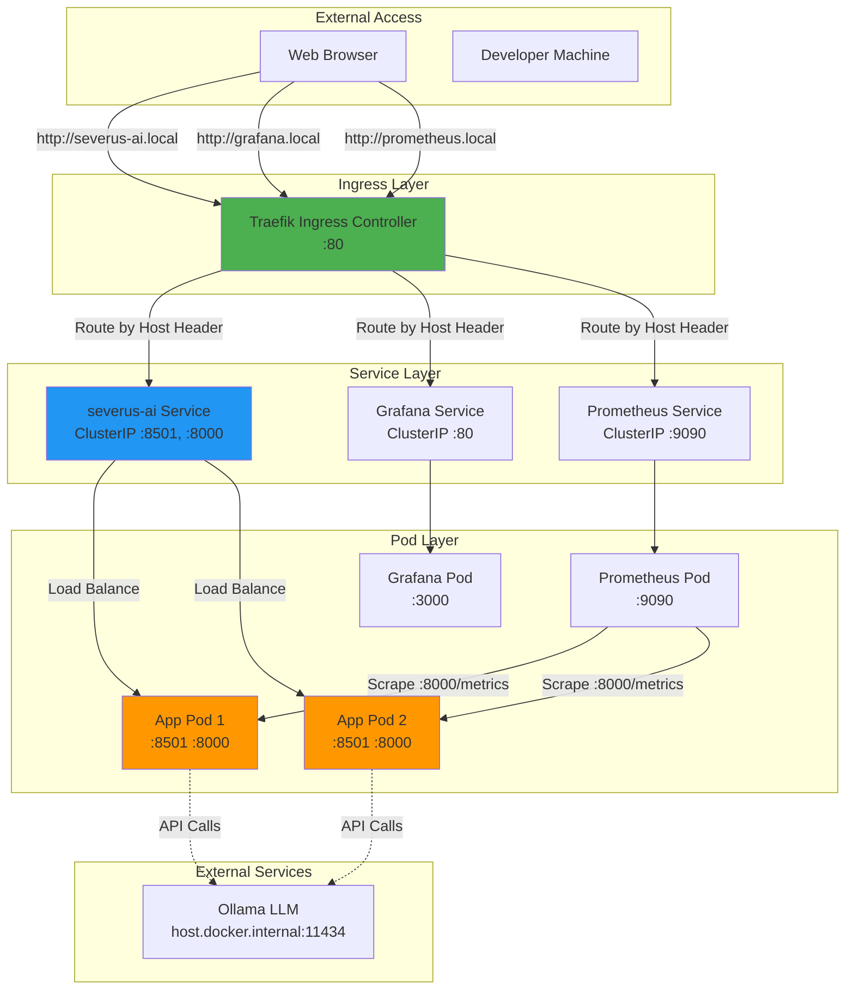
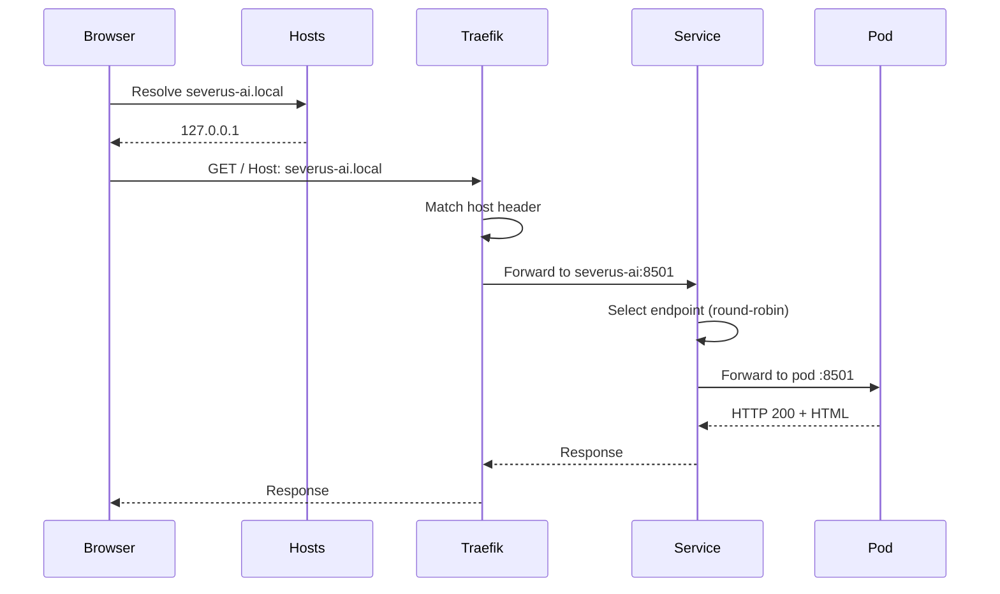

# Severus AI - Networking Architecture

## Table of Contents
1. [Overview](#overview)
2. [Network Topology](#network-topology)
3. [Kubernetes Networking](#kubernetes-networking)
4. [Ingress and Load Balancing](#ingress-and-load-balancing)
5. [Service Mesh Ready](#service-mesh-ready)
6. [Docker Networking](#docker-networking)
7. [Proxy Configuration](#proxy-configuration)
8. [Required Services and Ports](#required-services-and-ports)

---

## Overview

The Severus AI networking architecture leverages Kubernetes networking primitives for service discovery, load balancing, and ingress routing. The system is designed for **cloud-native portability** and **service mesh readiness**.

---

## Network Topology



---

## Kubernetes Networking

### Pod-to-Pod Communication

**Network Plugin**: k3s default (Flannel)  
**CIDR**: `10.42.0.0/16` (pod network)

```bash
# Example pod IPs
severus-ai-6694446bdc-qvvs9:   10.42.0.66
severus-ai-6694446bdc-abc12:   10.42.0.67
prometheus-xxx-0:              10.42.0.68
```

**Communication:**
- All pods can reach each other directly via pod IP
- DNS resolution via CoreDNS
- No network policies (allow all traffic)

### Service Discovery

**ClusterIP Services:**
```bash
# Service DNS names (internal cluster only)
severus-ai.default.svc.cluster.local:8501
severus-ai.default.svc.cluster.local:8000
kube-prometheus-stack-grafana.default.svc.cluster.local:80
kube-prometheus-stack-prometheus.default.svc.cluster.local:9090
```

**Short Names (within default namespace):**
```bash
severus-ai:8501
severus-ai:8000
kube-prometheus-stack-grafana:80
kube-prometheus-stack-prometheus:9090
```

### Load Balancing

**Algorithm**: Round-robin (default kube-proxy)

**Example Traffic Flow:**
```
Request → severus-ai:8501
  ↓
Service selects endpoint:
  - 10.42.0.66:8501 (Pod 1)
  - 10.42.0.67:8501 (Pod 2)
  ↓
Connection established to selected pod
```

**Session Affinity**: None (stateless application)

---

## Ingress and Load Balancing

### Traefik Ingress Controller

**Deployment:**
```bash
kubectl -n kube-system get svc traefik
NAME      TYPE           CLUSTER-IP      EXTERNAL-IP   PORT(S)
traefik   LoadBalancer   10.43.123.45    172.21.0.2    80:30080/TCP,443:30443/TCP
```

**Host-Based Routing:**
```yaml
# severus-ai Ingress
rules:
  - host: severus-ai.local
    http:
      paths:
        - path: /
          backend:
            service:
              name: severus-ai
              port:
                number: 8501

# Grafana Ingress
rules:
  - host: grafana.local
    http:
      paths:
        - path: /
          backend:
            service:
              name: kube-prometheus-stack-grafana
              port:
                number: 80

# Prometheus Ingress
rules:
  - host: prometheus.local
    http:
      paths:
        - path: /
          backend:
            service:
              name: kube-prometheus-stack-prometheus
              port:
                number: 9090
```

### Request Flow



### Local Access Configuration

**Edit `/etc/hosts`:**
```bash
sudo nano /etc/hosts
```

**Add Lines:**
```
127.0.0.1 severus-ai.local
127.0.0.1 grafana.local
127.0.0.1 prometheus.local
```

**Port Forward Traefik (for local clusters):**
```bash
kubectl -n kube-system port-forward svc/traefik 80:80
```

**Access:**
- http://severus-ai.local (Streamlit UI)
- http://grafana.local (Grafana dashboards)
- http://prometheus.local (Prometheus UI)

---

## Service Mesh Ready

### Why Service Mesh?

**Current**: Basic Kubernetes networking  
**Future**: Service mesh (Istio/Linkerd) for:
- mTLS encryption between pods
- Advanced traffic routing (canary, blue/green)
- Fine-grained observability
- Circuit breaking and retries

### Istio Integration (Example)

```yaml
apiVersion: networking.istio.io/v1beta1
kind: VirtualService
metadata:
  name: severus-ai
spec:
  hosts:
    - severus-ai.local
  gateways:
    - severus-ai-gateway
  http:
    - match:
        - uri:
            prefix: /
      route:
        - destination:
            host: severus-ai
            port:
              number: 8501
          weight: 90
        - destination:
            host: severus-ai-v2
            port:
              number: 8501
          weight: 10  # Canary 10% traffic to v2
```

---

## Docker Networking

### Docker Desktop Networking

**Context**: `desktop-linux`

**Networks:**
- `bridge`: Default Docker network
- `host`: Host network mode (not used)
- `none`: No networking (not used)

### Host Access from Pods

**Problem**: Pods need to reach Ollama on host machine

**Solution**: `host.docker.internal`

```bash
# In pod environment
OLLAMA_BASE_URL=http://host.docker.internal:11434
```

**How It Works:**
1. Docker Desktop creates a special DNS name: `host.docker.internal`
2. Resolves to host's IP from container perspective
3. Pod can make HTTP requests to host services

**Example:**
```bash
# From inside pod
curl http://host.docker.internal:11434/api/tags
```

---

## Proxy Configuration

### Docker Proxy Setup

**Issue**: Docker builds may fail without proxy configuration when behind corporate firewall

**Solution (if needed):**

```bash
# ~/.docker/config.json
{
  "proxies": {
    "default": {
      "httpProxy": "http://proxy.company.com:8080",
      "httpsProxy": "http://proxy.company.com:8080",
      "noProxy": "localhost,127.0.0.1,*.local"
    }
  }
}
```

**Jenkins Pipeline Configuration:**
```groovy
environment {
    HTTP_PROXY = "http://proxy.company.com:8080"
    HTTPS_PROXY = "http://proxy.company.com:8080"
    NO_PROXY = "localhost,127.0.0.1,*.local,10.0.0.0/8"
}
```

### Docker Build with Proxy

```bash
docker build \
  --build-arg HTTP_PROXY=$HTTP_PROXY \
  --build-arg HTTPS_PROXY=$HTTPS_PROXY \
  --build-arg NO_PROXY=$NO_PROXY \
  -t severus-ai:v1 .
```

### Kubernetes Pods with Proxy

```yaml
env:
  - name: HTTP_PROXY
    value: "http://proxy.company.com:8080"
  - name: HTTPS_PROXY
    value: "http://proxy.company.com:8080"
  - name: NO_PROXY
    value: "localhost,127.0.0.1,10.42.0.0/16"
```

---

## Required Services and Ports

### Application Services

| Service | Port | Protocol | Purpose | Access |
|---------|------|----------|---------|--------|
| **Severus AI (UI)** | 8501 | HTTP | Streamlit web interface | http://severus-ai.local |
| **Severus AI (Metrics)** | 8000 | HTTP | Prometheus metrics | Internal (scraped by Prometheus) |
| **Ollama LLM** | 11434 | HTTP | AI model inference | host.docker.internal:11434 |

### Monitoring Services

| Service | Port | Protocol | Purpose | Access |
|---------|------|----------|---------|--------|
| **Prometheus** | 9090 | HTTP | Metrics storage and queries | http://prometheus.local |
| **Grafana** | 3000 | HTTP | Dashboard visualization | http://grafana.local |
| **AlertManager** | 9093 | HTTP | Alert routing and silencing | Internal |

### Infrastructure Services

| Service | Port | Protocol | Purpose | Access |
|---------|------|----------|---------|--------|
| **Traefik** | 80 | HTTP | Ingress controller | Port-forward to localhost |
| **Traefik (HTTPS)** | 443 | HTTPS | Secure ingress (not configured) | Future |
| **Kubernetes API** | 6443 | HTTPS | Cluster management | kubectl access |
| **CoreDNS** | 53 | DNS | Service discovery | Internal |

### Port Forwarding Commands

```bash
# Access Traefik ingress
kubectl -n kube-system port-forward svc/traefik 80:80

# Access Prometheus directly (bypass ingress)
kubectl port-forward svc/kube-prometheus-stack-prometheus 9090:9090

# Access Grafana directly (bypass ingress)
kubectl port-forward svc/kube-prometheus-stack-grafana 3000:80

# Access application directly (bypass ingress)
kubectl port-forward svc/severus-ai 8501:8501
```

---

## Network Security Considerations

### Current Setup (Development)

- ❌ No TLS/HTTPS
- ❌ No network policies (all pods can communicate)
- ❌ No authentication on Prometheus/metrics endpoints
- ❌ Traefik uses HTTP only

### Production Recommendations

1. **Enable TLS:**
   ```yaml
   # Traefik with Let's Encrypt
   --set traefik.ssl.enabled=true
   --set traefik.ssl.certificatesResolvers.letsencrypt=true
   ```

2. **Network Policies:**
   ```yaml
   apiVersion: networking.k8s.io/v1
   kind: NetworkPolicy
   metadata:
     name: severus-ai-policy
   spec:
     podSelector:
       matchLabels:
         app: severus-ai
     policyTypes:
       - Ingress
       - Egress
     ingress:
       - from:
         - podSelector:
             matchLabels:
               app: traefik
         ports:
           - protocol: TCP
             port: 8501
     egress:
       - to:
         - podSelector:
             matchLabels:
               app: ollama
         ports:
           - protocol: TCP
             port: 11434
   ```

3. **Authentication:**
   - Grafana: Already has admin/password
   - Prometheus: Add OAuth2 proxy
   - Application: Implement RBAC

---

## Summary

The networking architecture provides:
- ✅ **Kubernetes-native** service discovery
- ✅ **Ingress-based** HTTP routing with host headers
- ✅ **Load balancing** across multiple pods
- ✅ **Service mesh ready** for advanced features
- ✅ **Clear separation** of services (UI, metrics, monitoring)
- ✅ **Local development** support via /etc/hosts

This design ensures **portability**, **scalability**, and **observability** while maintaining simplicity for development workflows.
