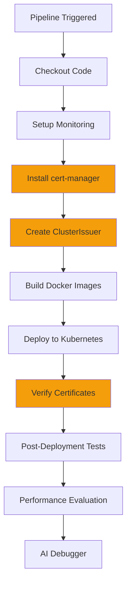

# Automated Certificate Deployment in Jenkins

## Overview

The Jenkins pipeline now **automatically handles all certificate setup** with zero manual intervention. When you trigger the pipeline, it will:

1. ✅ Install cert-manager (if not already installed)
2. ✅ Create ClusterIssuer for certificate signing
3. ✅ Generate certificates for Severus AI and stress-pod
4. ✅ Verify certificates are created successfully
5. ✅ Deploy application with certificates mounted

---

## What Happens Automatically

### Stage 1: Install cert-manager
```bash
# Jenkins automatically runs:
kubectl apply -f https://github.com/cert-manager/cert-manager/releases/download/v1.14.0/cert-manager.yaml

# Waits for cert-manager pods to be ready
kubectl wait --for=condition=ready pod -l app=cert-manager -n cert-manager
```

**What it does:**
- Checks if cert-manager is already installed
- Installs cert-manager v1.14.0 if needed
- Waits for all cert-manager components to be ready
- Verifies installation by listing pods

### Stage 2: Create Certificate Issuer
```bash
# Jenkins automatically runs:
kubectl apply -f k8s/cluster-issuer.yaml

# Verifies ClusterIssuer is ready
kubectl get clusterissuer
```

**What it does:**
- Creates self-signed ClusterIssuer
- Creates root CA certificate
- Creates CA-based issuer for signing pod certificates
- Verifies issuer is ready to sign certificates

### Stage 3: Deploy Application
```bash
# Jenkins automatically runs:
helm upgrade --install severus-ai helm/severus-ai
```

**What it does:**
- Helm creates Certificate resources (severus-ai-tls, stress-pod-tls)
- cert-manager automatically generates certificates
- Certificates are stored in Kubernetes secrets
- Secrets are mounted in pods at `/etc/certs/`

### Stage 4: Verify Certificates
```bash
# Jenkins automatically runs:
kubectl get certificates
kubectl get secrets | grep tls
kubectl describe certificate severus-ai-tls
```

**What it does:**
- Checks certificate status (should be READY=True)
- Verifies certificate secrets exist
- Shows certificate details (expiration, DNS names, etc.)
- Logs any certificate issues

---

## Pipeline Flow



---

## What You Need to Do

### Nothing! 🎉

Just trigger your Jenkins pipeline as usual:

```bash
# Push code to trigger pipeline
git add .
git commit -m "Updated application"
git push

# Or trigger manually in Jenkins UI
```

The pipeline will handle everything automatically.

---

## First-Time Setup

On the **first pipeline run**, you'll see:

1. **cert-manager installation** (~2-3 minutes)
   - Downloads and installs cert-manager CRDs
   - Creates cert-manager namespace
   - Deploys cert-manager controller, webhook, and cainjector

2. **ClusterIssuer creation** (~10 seconds)
   - Creates self-signed issuer
   - Generates root CA certificate
   - Creates CA-based issuer

3. **Certificate generation** (~15 seconds)
   - Creates severus-ai-tls certificate
   - Creates stress-pod-tls certificate
   - Stores certificates in Kubernetes secrets

### Subsequent Runs

On **subsequent pipeline runs**:

1. **cert-manager check** (~5 seconds)
   - Detects cert-manager is already installed
   - Skips installation
   - Proceeds to next stage

2. **ClusterIssuer update** (~5 seconds)
   - Applies ClusterIssuer configuration (idempotent)
   - No changes if already exists

3. **Certificate renewal** (automatic)
   - cert-manager automatically renews certificates 15 days before expiration
   - No manual intervention needed

---

## Verification in Jenkins Logs

### Successful cert-manager Installation

```
🔐 Installing cert-manager for certificate management...
📥 Installing cert-manager v1.14.0...
⏳ Waiting for cert-manager to be ready...
pod/cert-manager-xxxxxxxxxx-xxxxx condition met
pod/cert-manager-cainjector-xxxxxxxxxx-xxxxx condition met
pod/cert-manager-webhook-xxxxxxxxxx-xxxxx condition met
✅ cert-manager installed successfully
```

### Successful ClusterIssuer Creation

```
🔑 Creating ClusterIssuer for certificate signing...
clusterissuer.cert-manager.io/selfsigned-cluster-issuer created
certificate.cert-manager.io/severus-ai-ca created
clusterissuer.cert-manager.io/severus-ai-ca-issuer created
⏳ Waiting for ClusterIssuer to be ready...
✅ ClusterIssuer created successfully
```

### Successful Certificate Verification

```
🔍 Verifying certificates are created...
📋 Certificate Status:
NAME              READY   SECRET            AGE
severus-ai-tls    True    severus-ai-tls    30s
stress-pod-tls    True    stress-pod-tls    30s

🔐 Certificate Secrets:
severus-ai-tls    kubernetes.io/tls    3      30s
stress-pod-tls    kubernetes.io/tls    3      30s

✅ Certificate verification completed
```

---

## Troubleshooting

### cert-manager Installation Fails

**Symptom:** Pipeline fails at "Install cert-manager" stage

**Solution:**
```bash
# Manually check cert-manager status
kubectl get pods -n cert-manager

# If stuck, delete and let pipeline reinstall
kubectl delete namespace cert-manager
# Re-run pipeline
```

### ClusterIssuer Not Ready

**Symptom:** ClusterIssuer shows READY=False

**Solution:**
```bash
# Check issuer status
kubectl describe clusterissuer severus-ai-ca-issuer

# Check cert-manager logs
kubectl logs -n cert-manager -l app=cert-manager

# Usually resolves on next pipeline run
```

### Certificates Not Created

**Symptom:** `kubectl get certificates` shows no certificates

**Solution:**
```bash
# Certificates are created by Helm deployment
# Check if Helm deployment succeeded
helm list

# Check certificate resources
kubectl get certificate -A

# If missing, re-run pipeline
```

### Certificate Stuck in "Pending"

**Symptom:** Certificate shows READY=False for extended time

**Solution:**
```bash
# Check certificate status
kubectl describe certificate severus-ai-tls

# Common causes:
# - ClusterIssuer not ready
# - cert-manager not running
# - Invalid certificate spec

# Check cert-manager logs
kubectl logs -n cert-manager -l app=cert-manager --tail=50
```

---

## Configuration

### Disable Certificates (if needed)

If you want to disable certificate verification temporarily:

**Option 1: Permissive Mode (recommended for testing)**
```yaml
# In helm/severus-ai/values.yaml
certificates:
  enabled: true
  verification:
    enforceMode: permissive  # Allows non-certificate traffic
```

**Option 2: Disable Completely**
```yaml
# In helm/severus-ai/values.yaml
certificates:
  enabled: false  # Disables all certificate features
```

### Skip cert-manager Installation

If you already have cert-manager installed cluster-wide:

The pipeline automatically detects existing cert-manager installation and skips the installation step.

---

## Monitoring Certificate Status

### During Pipeline Run

Check Jenkins console output for:
- ✅ cert-manager installation status
- ✅ ClusterIssuer creation status
- ✅ Certificate verification results

### After Deployment

```bash
# Check certificate status
kubectl get certificates

# Check certificate details
kubectl describe certificate severus-ai-tls

# Check certificate expiration
kubectl get secret severus-ai-tls -o jsonpath='{.data.tls\.crt}' | base64 -d | openssl x509 -noout -enddate

# Check cert-manager logs
kubectl logs -n cert-manager -l app=cert-manager --tail=50
```

---

## Summary

✅ **Fully Automated**: No manual steps required  
✅ **Idempotent**: Safe to run multiple times  
✅ **Self-Healing**: Certificates auto-renew before expiration  
✅ **Verified**: Pipeline checks certificate creation  
✅ **Production-Ready**: Starts in permissive mode, switch to strict when ready  

Just trigger your Jenkins pipeline and everything will be set up automatically! 🚀
