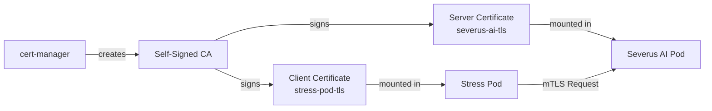

# Certificate Management for Severus AI

## Overview

Severus AI uses **mutual TLS (mTLS)** for secure pod-to-pod communication. This ensures that only trusted pods with valid certificates can communicate with the Severus AI service.

## Architecture

### Components

1. **cert-manager**: Kubernetes certificate management controller
2. **ClusterIssuer**: Self-signed CA for internal certificates
3. **Certificates**: Automatically generated and renewed certificates for each pod
4. **Secrets**: Kubernetes secrets containing certificate data

### Certificate Flow



## Installation

### 1. Install cert-manager

```bash
# Install cert-manager
kubectl apply -f https://github.com/cert-manager/cert-manager/releases/download/v1.14.0/cert-manager.yaml

# Verify installation
kubectl get pods -n cert-manager
```

### 2. Create ClusterIssuer

```bash
# Create self-signed CA
kubectl apply -f k8s/cluster-issuer.yaml

# Verify ClusterIssuer
kubectl get clusterissuer
kubectl describe clusterissuer severus-ai-ca-issuer
```

### 3. Deploy Severus AI with Certificates

```bash
# Deploy using Helm
helm upgrade --install severus-ai ./helm/severus-ai

# Verify certificates are created
kubectl get certificates
kubectl get secrets | grep tls
```

## Certificate Configuration

### values.yaml

```yaml
certificates:
  enabled: true
  issuer: severus-ai-ca-issuer
  
  serverCert:
    secretName: severus-ai-tls
    dnsNames:
      - severus-ai
      - severus-ai.default.svc.cluster.local
  
  clientCert:
    secretName: stress-pod-tls
  
  verification:
    enforceMode: permissive  # or "strict"
```

### Enforcement Modes

- **permissive**: Allows requests without certificates (logs warnings)
- **strict**: Rejects all requests without valid certificates

## How It Works

### Server Side (Severus AI)

1. Certificate is mounted at `/etc/certs/`
2. `cert_middleware.py` verifies incoming client certificates
3. Valid certificates are logged and tracked in metrics
4. Invalid/missing certificates are rejected (strict mode) or logged (permissive mode)

### Client Side (stress-pod)

1. Client certificate is mounted at `/etc/certs/`
2. `stress_pod.sh` uses `curl` with `--cert`, `--key`, and `--cacert` flags
3. Automatic fallback to plain HTTP if certificates are not found

## Certificate Details

### Server Certificate (severus-ai-tls)

- **Common Name**: severus-ai
- **Organization**: severus-ai
- **DNS Names**: 
  - severus-ai
  - severus-ai.default.svc.cluster.local
- **Usages**: server auth, client auth, digital signature, key encipherment
- **Duration**: 90 days
- **Renewal**: 15 days before expiration

### Client Certificate (stress-pod-tls)

- **Common Name**: stress-pod
- **Organization**: stress-pod
- **Usages**: client auth, digital signature, key encipherment
- **Duration**: 90 days
- **Renewal**: 15 days before expiration

## Verification

### Check Certificate Status

```bash
# List certificates
kubectl get certificates

# Check certificate details
kubectl describe certificate severus-ai-tls
kubectl describe certificate stress-pod-tls

# View certificate secret
kubectl get secret severus-ai-tls -o yaml
```

### Inspect Certificate Contents

```bash
# Extract certificate
kubectl get secret severus-ai-tls -o jsonpath='{.data.tls\.crt}' | base64 -d > cert.pem

# View certificate details
openssl x509 -in cert.pem -text -noout

# Check expiration
openssl x509 -in cert.pem -noout -enddate
```

### Test mTLS Connection

```bash
# From stress-pod
kubectl exec -it job/stress-pod -- sh
curl --cert /etc/certs/tls.crt \
     --key /etc/certs/tls.key \
     --cacert /etc/certs/ca.crt \
     https://severus-ai:8501

# From a pod without certificate (should fail in strict mode)
kubectl run test --image=curlimages/curl --rm -it -- \
  curl http://severus-ai:8501
```

## Monitoring

### Prometheus Metrics

```bash
# Check certificate verification metrics
curl http://severus-ai:8000/metrics | grep cert_verification

# Expected metrics:
# severus_cert_verification_success_total
# severus_cert_verification_failure_total{reason="missing"}
# severus_cert_verification_failure_total{reason="invalid_signature"}
```

### Logs

```bash
# Check Severus AI logs for certificate verification
kubectl logs -l app=severus-ai -c severus-ai | grep -i cert

# Expected log entries:
# ✅ Valid certificate from: stress-pod
# ❌ Invalid certificate signature
# ⚠️  Request rejected: No client certificate provided
```

## Adding New Trusted Pods

To allow a new pod to communicate with Severus AI:

### 1. Create Certificate Resource

```yaml
apiVersion: cert-manager.io/v1
kind: Certificate
metadata:
  name: new-pod-tls
  namespace: default
spec:
  secretName: new-pod-tls
  duration: 2160h  # 90 days
  renewBefore: 360h  # 15 days
  subject:
    organizations:
      - new-pod
  commonName: new-pod
  privateKey:
    algorithm: RSA
    size: 2048
  usages:
    - client auth
    - digital signature
    - key encipherment
  issuerRef:
    name: severus-ai-ca-issuer
    kind: ClusterIssuer
```

### 2. Mount Certificate in Pod

```yaml
spec:
  containers:
    - name: new-pod
      volumeMounts:
        - name: tls-certs
          mountPath: /etc/certs
          readOnly: true
  volumes:
    - name: tls-certs
      secret:
        secretName: new-pod-tls
```

### 3. Use Certificate in Requests

```bash
curl --cert /etc/certs/tls.crt \
     --key /etc/certs/tls.key \
     --cacert /etc/certs/ca.crt \
     http://severus-ai:8501
```

## Troubleshooting

### Certificate Not Created

```bash
# Check cert-manager logs
kubectl logs -n cert-manager -l app=cert-manager

# Check certificate status
kubectl describe certificate severus-ai-tls

# Common issues:
# - ClusterIssuer not ready
# - Invalid issuerRef
# - Namespace mismatch
```

### Certificate Verification Fails

```bash
# Check if certificate is mounted
kubectl exec -it deployment/severus-ai -- ls -la /etc/certs/

# Verify certificate is valid
kubectl exec -it deployment/severus-ai -- \
  openssl x509 -in /etc/certs/tls.crt -text -noout

# Check CA bundle
kubectl exec -it deployment/severus-ai -- \
  cat /etc/certs/ca.crt
```

### Connection Refused

```bash
# Check enforcement mode
kubectl get configmap -o yaml | grep CERT_ENFORCE_MODE

# Check logs
kubectl logs -l app=severus-ai -c severus-ai --tail=50

# Temporarily disable strict mode
helm upgrade severus-ai ./helm/severus-ai \
  --set certificates.verification.enforceMode=permissive
```

## Certificate Rotation

Certificates are automatically renewed by cert-manager 15 days before expiration.

### Manual Renewal

```bash
# Delete certificate secret (cert-manager will recreate)
kubectl delete secret severus-ai-tls

# Wait for recreation
kubectl get secret severus-ai-tls -w

# Restart pods to pick up new certificate
kubectl rollout restart deployment/severus-ai
```

## Security Best Practices

1. **Use strict mode in production**: Set `enforceMode: strict` after testing
2. **Monitor certificate expiration**: Set up alerts for certificate renewal failures
3. **Rotate CA periodically**: Create a new ClusterIssuer every 1-2 years
4. **Limit certificate scope**: Only create certificates for pods that need them
5. **Audit certificate usage**: Monitor metrics for unauthorized access attempts

## Disabling Certificates

To disable certificate verification:

```bash
# Update values.yaml
helm upgrade severus-ai ./helm/severus-ai \
  --set certificates.enabled=false

# Or edit values.yaml
certificates:
  enabled: false
```

## References

- [cert-manager Documentation](https://cert-manager.io/docs/)
- [Kubernetes TLS Secrets](https://kubernetes.io/docs/concepts/configuration/secret/#tls-secrets)
- [mTLS Best Practices](https://www.cloudflare.com/learning/access-management/what-is-mutual-tls/)
