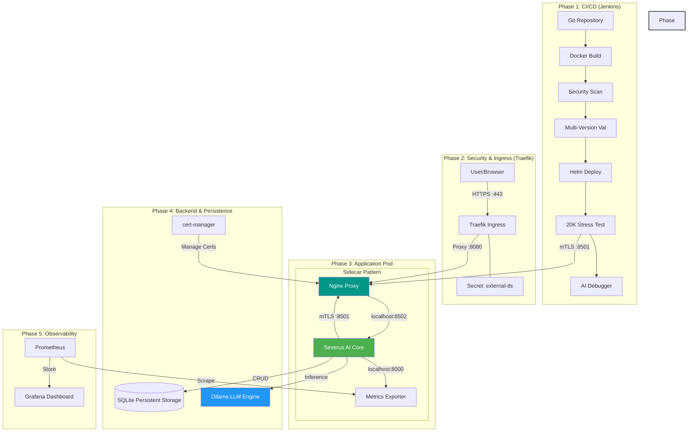

# Severus AI - Overall System Architecture

## 1. High-Level Concept

Severus AI is a cloud-native, end-to-end secured AI assistant platform. It integrates a **Streamlit** user interface with a **self-hosted Ollama LLM** backend, secured by **Mutual TLS (mTLS)** and **standard HTTPS**, and monitored via a comprehensive **Prometheus/Grafana** stack. 

The project introduces two major novelties for research consideration:
1. **Pre-Deployment Performance Validation (20K Stress Test)**: A performance-gated CI/CD pipeline.
2. **AI-Powered Automated Debugging**: A hybrid deterministic + AI system for immediate root cause analysis.

---

## 2. Integrated Architecture Diagram

This diagram shows the complete flow from code commit to production traffic, including security and monitoring.

---

## 3. Data Flow & Security Zones

### Secure Zones
1. **The DMZ (External)**: Public traffic is encrypted with standard TLS termination at the Ingress layer.
2. **The Trusted Internal Mesh**: Service-to-service communication is strictly authenticated via **Mutual TLS (mTLS)**.
3. **The Local Loopback**: Communication between Nginx, Streamlit, and Metrics is restricted to `localhost` to prevent external sniffing.

### Request Flow
1. **User Request**: Browser hits `https://severus-ai.local`.
2. **TLS Termination**: Traefik terminates SSL and forwards to `http://severus-ai:8080`.
3. **Nginx Ingress**: Nginx sidecar receives traffic on `8080` and proxies to Streamlit on `8502`.
4. **Internal mTLS**: The **Stress Pod** hits `https://severus-ai:8501`. Nginx validates its certificate before allowing access.
5. **LLM Inference**: Streamlit calls Ollama via the intelligent client, tracking duration and success in Prometheus.

---

## 4. Key Novelties Explained

### A. Performance-Gated Pipeline
Unlike standard CI/CD, Severus AI will **reject a deployment** if it cannot handle 20,000 requests without loss. This ensures that only performance-optimized code reaches the production environment.

### B. AI-Driven Root Cause Analysis
When a build fails, the **AI Debugger** acts as a virtual "Site Reliability Engineer" (SRE). It extracts the exact error token, finds the relevant file/line in the codebase, and asks a local LLM to propose a fix based on the specific context—all within 60 seconds of the failure.

---

## 5. Technology Stack Summary

| Layer | Component | Innovation |
|-------|-----------|------------|
| **UI/UX** | Streamlit | Real-time AI streaming & file analysis |
| **Security** | Nginx Sidecar | Mutual TLS (mTLS) enforcement |
| **Automation** | Jenkins | Parallel testing & performance gating |
| **AI Backend** | Ollama | Self-hosted, privacy-focused LLM |
| **Certificates**| cert-manager | Automated renewal & issuance |
| **Observability**| Prom/Grafana | 15+ custom application metrics |
| **Validation** | Stress Pod | High-concurrency performance testing |
