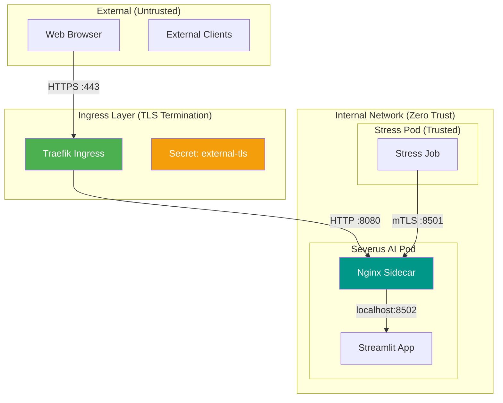

# Severus AI - Security Implementation Guide

## Overview

Severus AI implements a multi-layered security model designed for zero-trust environments. The architecture ensures that all communication, whether external from a browser or internal between services, is encrypted and authenticated.

### Core Security Pillars
1. **External HTTPS/TLS**: Standard TLS termination at the Ingress for secure browser access.
2. **Internal Mutual TLS (mTLS)**: Cryptographic authentication between pods using an Nginx sidecar.
3. **Automated Certificate Management**: Zero-touch certificate lifecycle management via `cert-manager`.
4. **Dual-Port Isolation**: Physical separation of public (HTTP) and private (mTLS) traffic within the pod.

---

## 1. Network Security Architecture

### Traffic Flow Diagram



### Port Strategy
| Port | Protocol | Layer | Purpose | Security |
|------|----------|-------|---------|----------|
| **443** | HTTPS | External | Browser Access | TLS terminated at Ingress |
| **8501**| HTTPS | Internal | Pod-to-Pod | mTLS (Verified by Nginx) |
| **8080**| HTTP | Internal | Ingress Proxy | Plain (Internal cluster only) |
| **8502**| HTTP | Local | Streamlit | localhost only |

---

## 2. Mutual TLS (mTLS) Implementation

The system uses an **Nginx sidecar** to offload SSL/TLS handling from the application code.

### Nginx Sidecar Logic
- **mTLS Validation**: On port `8501`, Nginx expects a client certificate signed by the `severus-ai-ca`.
- **Enforcement Modes**:
  - `verifyClient: "on"` (Strict): Rejects any request without a valid certificate.
  - `verifyClient: "optional"` (Permissive): Allows requests but logs certificate status.

### Certificate Verification
The application also includes a middleware layer (`cert_middleware.py`) that can double-check the certificate information passed by Nginx if needed, providing defense-in-depth.

---

## 3. Automated Certificate Management

We use `cert-manager` to automate the issuance and renewal of all certificates.

### Infrastructure Components
- **ClusterIssuer**: A self-signed CA (`severus-ai-ca-issuer`) that acts as our internal Root of Trust.
- **Certificates**:
  - `severus-ai-tls`: Server certificate for the backend.
  - `stress-pod-tls`: Client certificate for the testing job.
  - `severus-ai-external`: Certificate for the `severus-ai.local` hostname.

### Automatic Renewal
Certificates are valid for **90 days** and are automatically renewed by `cert-manager` **15 days** before they expire.

---

## 4. Administrative Security Tasks

### Trusting the CA for Browser Access
To get the "Secure" green lock in your browser:
1. Export the CA: `kubectl get secret severus-ai-ca-secret -n cert-manager -o jsonpath='{.data.tls\.crt}' | base64 -d > severus-ai-ca.crt`
2. Add to your Mac/Linux **System Keychain**.
3. Set trust to **"Always Trust"**.

### Manual Certificate Rotation
If a secret is compromised, you can force a rotation:
```bash
kubectl delete secret severus-ai-tls
kubectl rollout restart deployment/severus-ai
```

---

## 5. Security Checklist

- [x] All images run as non-root users.
- [x] Certificates are mounted as **read-only** volumes.
- [x] Streamlit is bound to `localhost` to prevent direct external access bypassing Nginx.
- [x] Ingress uses `traefik` with built-in protection against common attacks.

---

## 6. Future Enhancements
- **Network Policies**: Implement `NetworkPolicy` to restrict traffic at the IP level.
- **Vault Integration**: Move certificate storage to HashiCorp Vault.
- **Runtime Security**: Implement Falco or Sysdig for intrusion detection.
