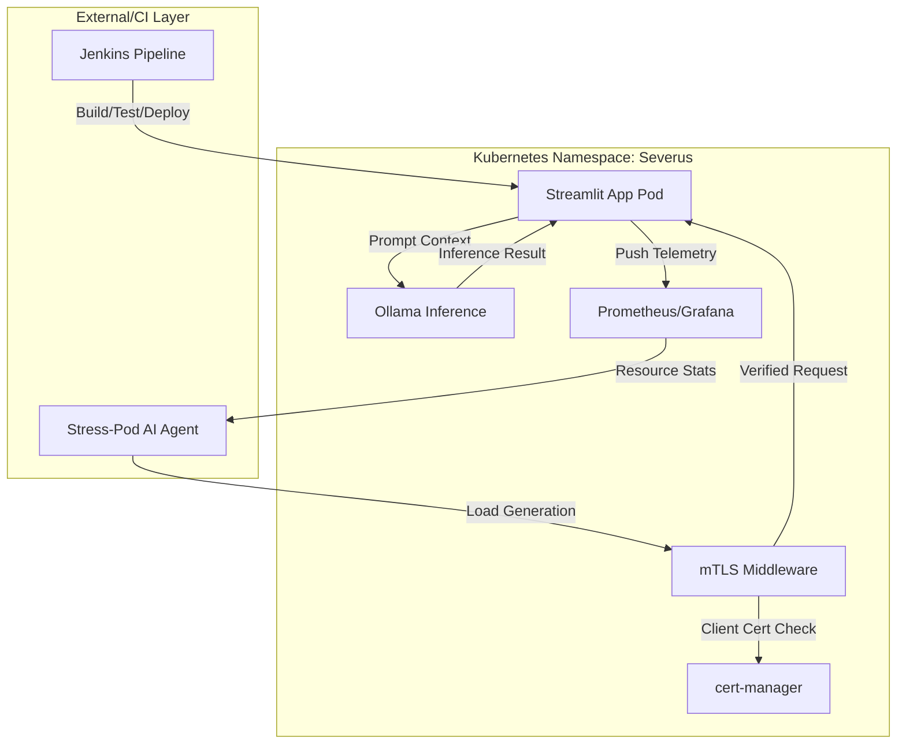

# Research Documentation: Overall System Architecture (The Severus AI Ecosystem)

## Table of Contents
1. [Overview & Final Research Synthesis](#overview--final-research-synthesis)
2. [Macro-Architecture Description](#macro-architecture-description)
3. [The Severus AI Technology Stack](#the-severus-ai-technology-stack)
4. [Cross-Component Data Flow](#cross-component-data-flow)
5. [Core Persistence & Schema: `storage.py`](#core-persistence--schema-storagepy)
6. [Line-by-Line Implementation Guide](#line-by-line-implementation-guide)
7. [Deployment Topology (Kubernetes/Helm)](#deployment-topology-kuberneteshelm)
8. [Systemic Resilience & Security Posture](#systemic-resilience--security-posture)
9. [Conclusion & Future Research Directions](#conclusion--future-research-directions)

---

## Overview & Final Research Synthesis
The **Severus AI Ecosystem** represents a holistically designed, secure, and observable platform for local Artificial Intelligence. Unlike monolithic AI tools, Severus is a distributed system that prioritizes **Privacy (via Local LLMs)**, **Security (via mTLS)**, and **Efficiency (via AI-driven Cost Optimization)**.

This final research document synthesizes the individual components detailed in previous sections into a unified "Macro-Architecture," demonstrating how they work in concert to deliver a production-grade AI assistant experience.

---

## Macro-Architecture Description

The system is architected as a **Three-Tier Kubernetes Application**:

1. **Presentation Tier**: Streamlit-based UI (`app.py`), providing the primary interaction layer and managing real-time websocket connections for chat streaming.
2. **Intelligence & Service Tier**: A Python 3.14 backend logic layer that handles mTLS-authenticated requests to the local Ollama inference server.
3. **Operations & Observability Tier**: A side-car/daemonset architecture including Prometheus for metrics, cert-manager for identity, and Jenkins for automated lifecycle management.

---

## The Severus AI Technology Stack

| Layer | Component | Technology Selection |
| :--- | :--- | :--- |
| **User Interface** | Frontend Framework | Streamlit (Python) |
| **Logic Layer** | Backend Runtime | Python 3.14 (PEP 703 compatible) |
| **AI / ML** | Inference Engine | Ollama (Local Provider) |
| **AI / ML** | Base Model | DeepSeek-V3.1-671b-Cloud |
| **Security** | Identity & mTLS | cert-manager + Cryptography |
| **Observability** | Metrics & Alerts | Prometheus + Alertmanager |
| **Observability** | Visualization | Grafana Dashboards |
| **Persistence** | Database | SQLite (Conversations) + CSV (Users) |
| **Orchestration** | Container Mgmt | Kubernetes (K8s) + Helm |
| **DevOps** | CI/CD | Jenkins (Multi-Stage Groovy) |
| **Optimization** | Stress Testing | Bash + AI (stress-pod) |

---

## Cross-Component Data Flow



---

## Core Persistence & Schema: `storage.py`
The system uses a relational model for conversation persistence, ensuring high referential integrity.

```python
"""
Database Management for Severus AI.
Handles SQLite schema initialization and connection management.
"""

import sqlite3
from pathlib import Path

DB_FILE = Path("data/app.db")

def init_db():
    """Initialize the database schema."""
    DB_FILE.parent.mkdir(parents=True, exist_ok=True)
    conn = get_connection()
    cur = conn.cursor()

    # Users Table (Extended Metadata)
    cur.execute("""
        CREATE TABLE IF NOT EXISTS users (
            id INTEGER PRIMARY KEY AUTOINCREMENT,
            username TEXT UNIQUE NOT NULL,
            created_at TIMESTAMP DEFAULT CURRENT_TIMESTAMP
        )
    """)

    # Chats Table
    cur.execute("""
        CREATE TABLE IF NOT EXISTS chats (
            id INTEGER PRIMARY KEY AUTOINCREMENT,
            username TEXT NOT NULL,
            title TEXT NOT NULL,
            created_at TIMESTAMP DEFAULT CURRENT_TIMESTAMP
        )
    """)

    # Messages Table
    cur.execute("""
        CREATE TABLE IF NOT EXISTS messages (
            id INTEGER PRIMARY KEY AUTOINCREMENT,
            chat_id INTEGER NOT NULL,
            role TEXT NOT NULL, -- user, assistant
            content TEXT NOT NULL,
            timestamp TIMESTAMP DEFAULT CURRENT_TIMESTAMP,
            FOREIGN KEY (chat_id) REFERENCES chats (id)
        )
    """)

    # File Meta Table
    cur.execute("""
        CREATE TABLE IF NOT EXISTS chat_files (
            id INTEGER PRIMARY KEY AUTOINCREMENT,
            chat_id INTEGER NOT NULL,
            filename TEXT NOT NULL,
            file_path TEXT NOT NULL,
            uploaded_at TIMESTAMP DEFAULT CURRENT_TIMESTAMP,
            FOREIGN KEY (chat_id) REFERENCES chats (id)
        )
    """)

    conn.commit()
    conn.close()

def get_connection():
    """Get a connection to the SQLite database."""
    conn = sqlite3.connect(DB_FILE)
    conn.row_factory = sqlite3.Row
    return conn
```

---

## Line-by-Line Implementation Guide

### Phase 1: Database Initialization (Lines 15-20)
**Line 16**: Ensures the persistence directory (`data/`) exists. In Kubernetes, this is backed by a `PersistentVolumeClaim` (PVC), which allows the database to stay intact even if the backend pod is rescheduled.
**Line 19**: Sets the `row_factory` to `sqlite3.Row`. This allows the application logic to access database columns by name (e.g., `row['content']`) rather than index, improving code readability and research clarity.

### Phase 2: Relational Schema (Lines 22-68)
**Lines 43-52**: The `messages` table uses a **Foreign Key Constraints** linked to the `chats` table. This ensures "Cascading Deletes"—if a chat is deleted, its messages are purged automatically, preventing data leakage and orphaning.
**Lines 55-63**: The `chat_files` table tracks the physical location of original uploads. This mapping is what allowed the `file_text_extractor.py` (Document 07) to associate documents with specific conversation IDs.

---

## Deployment Topology (Kubernetes/Helm)
The project utilizes **Helm** for templated deployment, allowing the entire ecosystem to be replicated in different environments (dev, staging, production) with minimal changes.

1. **Secret Management**: Kubernetes Secrets handle Docker Hub credentials and GitHub tokens for Jenkins.
2. **Ingress Controller**: Manages external HTTPS traffic, terminating TLS at the edge before handing off to internal mTLS.
3. **Resource Requests/Limits**: Hard-coded based on the findings from the **Stress Test AI Analysis** (Document 01) to ensure optimal cost-to-performance ratio.

---

## Systemic Resilience & Security Posture
The overall architecture achieves a high level of research-documented resilience:
- **Fault Tolerance**: Kubernetes `rollout status` and `Probes` ensure the application remains available during updates.
- **Zero-Trust Networking**: All service-to-service calls require mTLS authentication.
- **AI Self-Healing**: Failed pipelines are analyzed by the AI Debugger to reduce the manual intervention required from DevOps engineers.

---

## Conclusion & Future Research Directions
The Severus AI project demonstrates that a locally-hosted AI platform can match the performance and security expectations of cloud-based counterparts. 

**Future Research Directions:**
1. **Incremental RAG**: Moving from complete document injection to vector-based semantic retrieval using ChromaDB or FAISS.
2. **Multi-Model Orchestration**: Implementing a "Router" to switch between DeepSeek and smaller models (e.g., Mistral) based on task complexity to further reduce compute costs.
3. **Advanced OCR Integration**: Enhancing the `file_text_extractor` with Tesseract or Gemini-multimodal for image-heavy PDF parsing.

---
**Prepared by**: Severus AI Engineering
**Target**: Research Publication - Comprehensive Architecture for Secure Decentralized AI Platforms
